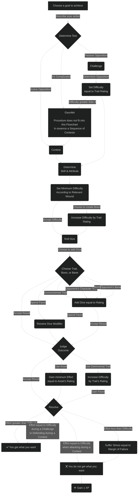

# Skill Tests

When you consult the dice, the game calls it a **Skill Test.** Forge Gauntlet uses a **d6** dice pool system. So whenever the game calls for dice to be rolled, roll a handful of six-sided dice equal to the rating of the [Attribute](../../characters/attributes) with which you chose to test. Each die can either be a hit or a miss, depending on if its face shows at least the training of the skill with which you chose to test.  
All hits counted together are called **Effort.** Achieving more Effort is always better.

A test has a difficulty, a number that defines how much effort it takes to succeed on the test, otherwise the test is a failure. There are no tests without consequences. No matter if you succeed on a test or fail it, you will either get what you want and/or suffer a setback. Either way, after a test both the narrative and your character make progress, either by achieving your goal or by growing with your failures.

## Improving with Failure

When you fail a skill test, you do not get what you want, but you mark **1** **XP** for the skill you used.

Apart from completing goals, this is the only way to gain **XP** for your skills.

## Let It Ride

If you fail a test, you may not repeat the test with the same skill and attribute again until something fundamentally changes about the situation. You may attempt a different attribute but the difficulty of the test might increase.

You may always change your approach and use a different skill to achieve your goal a different way.

# Challenges

Challenges are the most basic form of test. A test is a challenge when there is no other character or creature to directly or indirectly keep you from achieving your goal, or they are simply trying to keep you from achieving your goal without having any other goals of their own.

<figure>
  
  <figcaption>A good ol' late-night mugging can be resolved with a single challenge.</figcaption>
</figure>

Most often challenges result from an environmental trait that would noticeably hinder your effort or a character or creature with a trait that would noticeably hinder your effort opposing you. The trait's rating sets the test's difficulty.

Should it ever be unclear what difficulty a test is supposed to be, it will most likely be **1;** you only need to achieve **1** effort to succeed.

If both an environmental and an opponent's trait would notably hinder your efforts, add their ratings together to determine the test's difficulty.  
Only add the rating of **1** environmental trait and/or **1** opponent's trait to the difficulty of a challenge. When multiple would apply, choose the highest or most relevant.

If the difficulty of a challenge ever exceeds **3,** consider the characters' goals to determine if a single die roll really is the best way to resolve the situation or if a more detailed conflict in the form of a [Gauntlet](../gauntlets) would be more appropriate.

{: .note-title }
> Examples of Challenges
>
> - Jumping a ravine
> - Haggling with a merchant
> - Forging a weapon
> - Quietly murdering a guard keeping watch
> - Buying a horse

## Consequences

It is vital that the story is never unchanged after a skill test, so when you fail a challenge, at least one of a few different things which will happen.

In many cases the GM will introduce an interesting narrative consequence. Either you got what you wanted at a cost or something dramatic follows your failure.

Alternatively, as it is hard to come up with interesting consequences for every test, you might take a [Stress](../injury-&-misfortune.md#stress) equal to the difference between the test's difficulty and the effort you achieved (choose the [Type of Stress](../../characters#wounds#wound-types) depending on the situation and how you failed).  
If this causes you to take a new wound, name it something appropriate to represent your exhaustion, strain, or injury from your failure.

The aim is to create a solid baseline for the flow of play.

{: .important }
> Cyrene wants to enter the sultan's city but the gates are closed and will not open before sunrise. She decides to try her luck anyway. As she approaches the gate, she winks at the younger of the two guards.
>
> The skill is obvious in this scenario, she wants to Influence the guards to let her pass. Cyrene is trained at Influence, so for her every face of a **5** or higher is a success.
>
> For her Approach, she settles on Intuition. She is going with the flow, trying to draw something out of the guards to turn to her advantage. As her rating for Intuition is **5,** she will roll **5** dice.
>
> The GM decides a challenge will suffice to convincing the guards to let Cyrene pass.
>
> The sultan's city has the trait `UNDER MARTIAL LAW` with a rating of **2** so the difficulty for the test is also **2.** The curfew turns an otherwise trivial task into a challenge.
>
> Cyrene throws her **5** dice. Two dice come up **1** and. As she chose Intuition as her Approach, she uses her trait `Charming Stranger` to re-roll those **1s.** Her result now is **2, 3, 4, 4, 6.** All dice which come up **5+** are hits for her, so she achieved **1** effort; not enough to succeed. The guards remain untouched by her charm, though one ogles the sword at her side. She came to the city to rest not exhaust herself even more, nor is she willing to give up her sword to gain entry, so she decides against powering through and .
>
> She marks **1** **XP,** but now she must try another way to get into the city. She could try to frighten the guards into letting her pass, but with them already looking irritated and with her Vigor rating of **3,** she fears this might go poorly for her and so decides against it.

## Group Tests

Characters may act in tandem with each other when trying to achieve the same goal while testing the same skill (they may use different attributes, though most of the time, they will also use the same attributes). When they do, everyone tests and adds their successes together to determine if they manage to succeed as a group.

When two or more character use the same skill and the same attribute to achieve the same goal, they always test as a group. When they do, choose one charcter who is the main actor. Only that character can add dice from [Traits](../../characters/traits), [Boons and Banes](../boons-&-banes), and use their [Disposition](../../characters/attributes#disposition).

During challenge, for each participant beyond the first, the difficulty of the test is increased by **1.**

Group tests can be incredible tools to achieve great deeds. They can also simply be used to help your compatriots to overcome obstacles you find trivial. But they come at the cost of increasing the risk for all participants. You either win or you fail as a group.

When a group fails a challenge, each member of the group receives **1** **XP.**

When a group suffers stress, _each_ member of the group takes stress equal to the difference between the test's difficulty and the effort they, individually, achieved. As difficulty increases with each member of a group, this can result in drastic setbacks.

{: .important }
> Outside the city, Cyrene meets up with her travel companion Maro, who comes to her with grave news. They definitely need to enter the sultan's city _tonight._ Luckily, Maro remembers scaffolding at the south wall he passed by a few days ago. When they arrive fortune is on their side. Only a few guards in sight. But scaling the city wall undetected will still not be an easy task.
>
> The city wall has the trait `WEATHERED AND STEEP FORTIFICATIONS` with a rating of **2,** so the difficulty for the test is **2** but because of the `UNDER MARTIAL LAW`, there are `GUARDS PATROLLING THE WALLS`, though that trait only has rating **1** which increases the difficulty to **3** because they want to enter the city unseen.
>
> Though, they can use the `SCAFFOLDING` trait with rating **1** to their advantage.
>
> Cyrene and Maro attempt to climb the wall as a group, which increases the difficulty by **1** to **4.** They both test their Maneuver with Vigor (as the task will require endurance more than anything else). They both use the `SCAFFOLDING` trait to add **1** additional die to their roll. Cyrene rolls **2** hits and so does Maro for a total of **4** effort; just enough to succeed.
>
> Alone, none of them would not have managed to scale the wall undetected, but together they prevailed, and now they are finally inside.

# Contests

When characters oppose each other and each of them try to achieve a different goal, then the situation calls for a contest. A contest is similar to a challenge, though instead of a difficulty, opposing characters roll against each other and try to beat the other's effort.

<figure>
  
  <figcaption>A duel between mages can be resolved with a single contest.</figcaption>
</figure>

Before rolling for a contest, determine of inflicting harm on the opponent is part of the conflict. This will decide whether the consequence of losing the contest will be suffering an injury or misfortune.

The attacker, whoever initiated the contest, tests first; the achieved effort sets the difficulty of the defender. Then, the defender tests to try to achieve enough effort.

If the defender fails to succeed, the attacker wins and gets what they want and the defender does not.

If the defender succeeds, they win get what they want but the attacker does not.  
On ties the defender also wins and gets what they want.

The winner also inflicts harm on the loser equal to their margin of success (on ties no harm is inflicted), either as an injury, if inflicting harm was determined to be part of the contest, or as a misfortune, if it was not.

{: .note-title }
> Examples of Contests
>
> - A race to the finish line
> - A bidding war at an auction
> - Two rivals competing to see who can forge the better weapon
> - A tavern brawl to impress a patron
> - Taming a horse that wants to eat your underwear

## Traits during Contests

During contests, using your own traits to your detriment does not increase the difficulty for yourself but works a little differently. You also have access to your opponents' detrimental traits to exploit for your advantage.

### Detrimental Traits

When you test with a skill in a contest, you may use your traits to your detriment as you would during a challenge. Though, in most cases, your opponent will be the one to have that idea first. Instead of increasing the difficulty your opponent adds your trait's rating as dice to their roll.

When one of your traits is used against you this way, you may spend Favor equal to the trait's rating to not give your opponent any dice, similarly like you would during challenges.

{: .important }
> During a kerfuffle at court, Cyrene tries to embarrass one of the guests she met previously (when he crossed her during a previous adventure). She only manages **1** success on her roll, though he manages none at all, he invokes Cyrene's `DRUNKARD` trait against her to add **1** die to his roll. Cyrene may now spend **1** Iron to not give him that additional die, but she wants to see what will happen and decides against it.
>
> The obnoxious guest manages to roll a hit on his additional die and turns the outcome into a tie, which he, as the defender, wins. The court is now chuckling at Cyrene, as he deflects her insults right back into her face. What a windbag. At least she received **1** **XP** for her Influence from her **1** success.

### Opponents' Traits

During a contest, you may use **1** of your opponent's traits just as they can use yours, which is known to you by describing how you would leverage that trait to your advantage. If the group agrees that your creative efforts would result in an advantage for you, add its rating as dice to your roll.  
You may only use a single of your opponent's detrimental traits per test. If your opponent has multiple fitting detrimental traits, you may only choose **1** of them. If you are testing against multiple opponents, you may also choose **1** trait from among all their traits.

Once you have used an opponent's trait during a scene, you may do so until the scene ends or the scene changes so that your previous description would no longer grant you an advantage without having to go into detail how you would leverage that trait to your advantage.

You may use both an environmental _and_ one of your opponent's traits on the same roll.

{: .important }
> Cyrene tracks a ghoul through the sewers to its hiding place, where a fight erupts. Cyrene discovered the `LIGHT SENSITIVTY` trait with rating **2** of ghouls while doing research and raises the torch in her hand as she rushes forward. Everyone at the table agrees that she can invoke the trait to her advantage, both when attacking and defending, this way, and she adds **2** dice to her attack roll as she blinds the ghoul with fire. As long as she has her torch in this fight with the ghoul, she may add **2** additional dice to her attack and defense rolls.

## Group Contests

When a group tests during contests, the opposing side of the group adds **1** die for each participant beyond the first. When two or more groups test against each others, for each side, the original attacker and defender add **1** die for each participant on the opposing side beyond the first (this will get incredibly dangerous very quickly).

When a group fails a contest, the opposing side inflict stress to _each_ member of the group who lost equal to the difference between the opposing side's effort and the effort each member of the group individually mustered.

{: .note-title }
> Rulings
>
> In most cases, both the defender and the attacker test the same skill, though with the attribute of their choice. In some circumstances it might make sense to test different Skills, though those occasions will be uncommon.
>
> Sometimes there is no obvious defender for a contest. In that case, without a defender for the contest, on a tie, everyone loses. The GM may also introduce an unexpected defender to win instead in that scenario.
>
> There may be multiple attacking teams during a contest (though there is only ever **1** defending team) but there can only ever be a single winner; the attacking team, who achieves the greatest effort wins the contest. If two or more attacking teams are tied for greatest effort, they all lose and a different attacking team (or the defending team, if they are the only one left) win instead.

# Gauntlets

In general, a contest can handle any interaction between two or more characters; disagreements, arm-wrestling, races, even fights with only one test for each side.  
And challenges handle everything else without an opposing side; athletic challenges, public speeches, travelling, and even murder.

But a single roll does not always have enough weight to justify its effect on the narrative. For those occasions, when the stakes are high and the current scene requires a more dramatic resolution, Forge Gauntlet offers a more intricate resolution mechanic called a [Gauntlet](../gauntlets). In essence, it is a series of contests but with a lot more room for details and casualties. They are detailed in their own chapter.

{: .note-title }
> Examples of Gauntlets
>
> - Narratively poignant fights
> - Long-winded chases
> - Heartfelt debates
> - Grappling for influence over a city between underground factions
> - Continent-spanning journeys

# Resolving Tests in Revue

{: .note-title }
> Resolving Tests in Revue
>
> - Choose a goal to achieve.
> - Describe what action you would like to undertake in the fiction.
> - Choose a skill according to your goal and described action.
> - Pick an [Attribute](../../characters#attributes). If you have already described an action, try and go with the Attribute most fitting your description. Otherwise, let your choice of Attribute guide your roleplay.
> - Determine if the test will be a challenge, a contest, or a gauntlet.
> - **Roll the dice.**
> - The target number for your dice is determined by the skill you've chosen. Every face of a die that comes up as at least that number, is a hit, all others are misses.
> - Use traits either for dice modifiers, extra dice, or an increases difficulty, and spend Favor.
> - Determine the outcome of the test. If you succeeded, you get what you want, otherwise mark **1** **XP** and resolve the consequences of the test.

The following flowchart shows how to resolve a skill test step by step.

