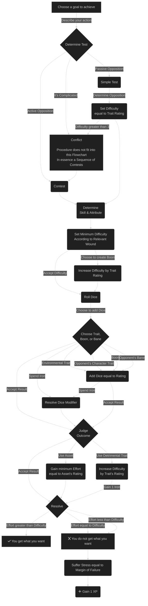

# Skill Tests

When you consult the dice, the game calls it a **Skill Test.** Gauntlet Forge uses a **d6** dice pool system. So whenever the game calls for dice to be rolled, roll a handful of six-sided dice equal to the rating of the [Attribute](../../characters/attributes) with which you chose to test. Each die can either be a hit or a miss, depending on if its face shows at least the training of the skill with which you chose to test.  
All hits counted together are called **Effort.** Achieving more Effort is always better.

A test has a difficulty, a number that defines how much Effort it takes to succeed on the test, otherwise the test is a failure. There are no tests without consequences. No matter if you succeed on a test or fail it, you will either get what you want and/or suffer a setback. Either way, after a test both the narrative and your character make progress, either by achieving your goal or by growing with your failures.

## Simple Tests

Simple tests are the most basic form of test. A test is simple when there is no other character or creature to directly or indirectly keep you from achieving your goal, or they are simply trying to keep you from achieving your goal without having any other goals of their own.

{: .note-title }
> Examples of Simple Tests
>
> - Jumping a ravine
> - Haggling with a merchant
> - Forging a weapon
> - Quietly murdering a guard keeping watch
> - Buying a horse

## Contests

When another character, creature, or even multiple not only want to keep you from achieving your goal but have a goal of their own; or when you want to keep them from achieving their goal, the action is resolved in a contest.

{: .note-title }
> Examples of Contests
>
> - A race to the finish line
> - A bidding war at an auction
> - Two rivals competing to see who can forge the better weapon
> - A tavern brawl to impress a patron
> - Taming a horse that wants to eat your underwear

## Conflicts

In general, a contest can handle any interaction between two or more characters; disagreements, arm-wrestling, races, even fights with only one test for each side.  
And simple tests handle everything else without an opposing side; athletic challenges, public speeches, travelling, and even murder.

But a single roll does not always have enough weight to justify its effect on the narrative. For those occasions, when the stakes are high and the current scene requires a more dramatic resolution, Gauntlet Forge offers a more intricate resolution mechanic called a [Conflict](../conflicts). In essence, it is a series of contests but with a lot more room for details and casualties. They are detailed in their own chapter.

{: .note-title }
> Examples of Conflicts
>
> - Narratively poignant fights
> - Long-winded chases
> - Heartfelt debates
> - Grappling for influence over a city between underground factions
> - Continent-spanning journeys

## Improving with Failure

When you fail a skill test, you do not get what you want, but you mark **1** **XP** for the skill you used.

Apart from completing goals, this is the only way go gain **XP** for your skills.

## Resolving Tests in Revue

{: .note-title }
> Resolving Tests in Revue
>
> - Choose a goal to achieve.
> - Describe what action you would like to undertake in the fiction.
> - Choose a skill according to your goal and described action.
> - Pick an [Attribute](../../characters#attributes). If you have already described an action, try and go with the Attribute most fitting your description. Otherwise, let your choice of Attribute guide your roleplay.
> - Determine if the test will be simple, a contest, or a conflict.
> - **Roll the dice.**
> - The target number for your dice is determined by the skill you've chosen. Every face of a die that comes up as at least that number, is a hit, all others are misses.
> - Use traits either for dice modifiers, extra dice, or an increases difficulty, and spend Iron.
> - Determine the outcome of the test. If you succeeded, you get what you want, otherwise mark **1** **XP** and resolve the consequences of the test.

The following flowchart shows how to resolve a skill test step by step.

